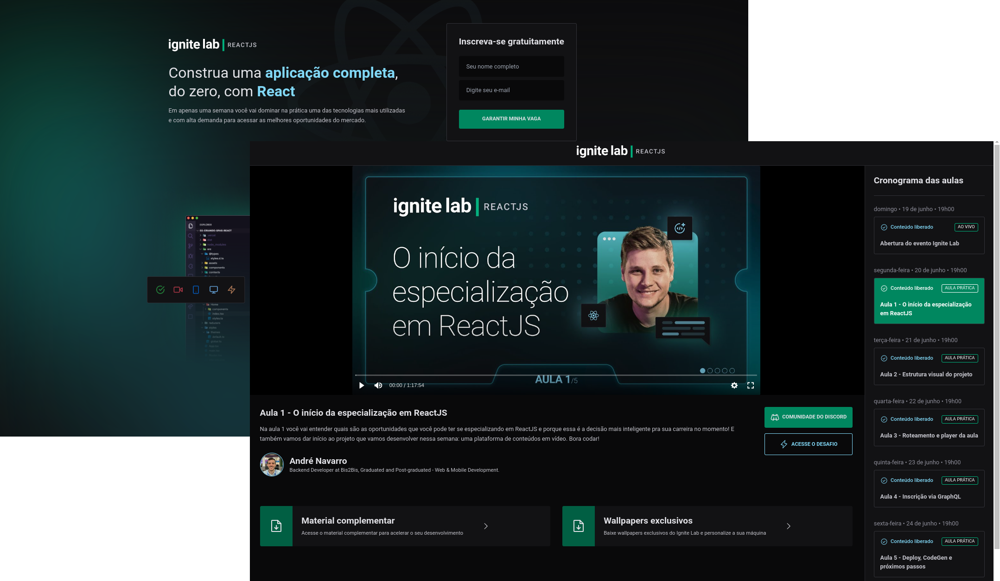

<p align="center">
  
</p>
<h1 align="center">
    Event Platform
</h1>

<p align="center">
  <a href="#-tecnologias">Tecnologias</a>&nbsp;&nbsp;&nbsp;|&nbsp;&nbsp;&nbsp;
  <a href="#-projeto">Projeto</a>&nbsp;&nbsp;&nbsp;|&nbsp;&nbsp;&nbsp;
  <a href="#-conceitos">Conceitos</a>&nbsp;&nbsp;&nbsp;|&nbsp;&nbsp;&nbsp;
  <a href="#-layout">Layout</a>&nbsp;&nbsp;&nbsp;|&nbsp;&nbsp;&nbsp;
  <a href="#-como-executar">Como executar</a>&nbsp;&nbsp;&nbsp;|&nbsp;&nbsp;&nbsp;
  <a href="#-future-tasks">Future Tasks</a>&nbsp;&nbsp;&nbsp;|&nbsp;&nbsp;&nbsp;
  <a href="#-licença">Licença</a>
</p>

<br>

<p align="center">
  
</p>

## ✨ Tecnologias

Esse projeto foi desenvolvido com as seguintes tecnologias:

- [React.js](https://pt-br.reactjs.org/)
- [Typescript](https://www.typescriptlang.org/)
- [HTML](https://developer.mozilla.org/pt-BR/docs/Web/HTML)
- [Tailwind CSS](https://tailwindcss.com/)
- [GraphQL](https://graphql.org/)
- [GraphCMS](https://graphcms.com/)
- [Apollo](https://www.apollographql.com/docs/react/)


## 💻 Projeto
Para utilizar a *Event Platform* (Plataforma de eventos), é necessário realizar o cadastro na primeira página da aplicação para que em seguida seja redirecionado automaticamente à página das aulas, podendo escolher qual aula deseja assistir.


## 📚 Conceitos

### <u>GraphQL</u>
Um substituto ao REST, é utilizado como padrão de consumo de APIs. O GraphQL é uma "query language", podendo realizar duas operações básicas:
- **Query**: Buscar dados específicos sem alterar seus valores;
- **Mutation**: Criar, alterar ou deletar dados;

### <u>GraphCMS</u>
Como uma aplicação de armazenamento de dados sem estilização, o GraphCMS permite construir um painel de administração para os dados da aplicação a fim de ser utilizado juntamente com o GraphQL.

Os dados utilizados na aplicação *Event Platform* foram salvos previamente no acesso ao GraphCMS. Qualquer alteração nos dados das aulas diretamente no no GraphCMS pode refletir na aplicação já em produção.

### <u>Apollo</u>
É utilizado como client para o GraphQL realizando o consumo de API. Basicamente é uma aplicação que faz a ligação entre a aplicação e o GraphCMS, onde são armazenados os dados para consumo.


## 🔖 Layout

Você pode visualizar o layout do projeto através [desse link](https://www.figma.com/file/KoNJ4kX5GfdJoVNRXCMcIR/Plataforma-de-evento---Ignite-Lab-(Community)?node-id=24%3A904). É necessário ter conta no [Figma](https://figma.com) para acessá-lo.

## 🚀 Como Executar

* 🌐 **Conectando-se à aplicação online**
    * Para acessar ao projeto em execução no ambiente da Vercel, acesse um dos seguintes links:

        [Link 1](event-platform-nine-cyan.vercel.app) / [Link 2](event-platform-andrenavarro.vercel.app) / [Link 3](event-platform-git-main-andrenavarro.vercel.app)

    * Feito isso, é necessário que seja feito o cadastro com o nome e e-mail para ter acesso à pagina do evento com o conteúdo das aulas.

<br>

* 🧑‍💻 **Conectando-se à aplicação localmente**
    * No [Github](https://github.com/AndreNavarro/Event-platform.git), faça um clone deste projeto em sua máquina com o seguinte comando:
        ```
        git clone https://github.com/AndreNavarro/Event-platform.git
        ```
    
    * Faça uma cópia do arquivo .env.sample e renomeie alterando o nome ".sample" para ".local". É necessário que sejam preenchidos os dados dentro destes arquivos.

  * 🖥️ **Aplicação web**  
    * Execute os comandos abaixo para carregar as dependências do projeto e iniciar a aplicação:
    
        ```
        npm install
        
        npm run dev
        ``` 
    
    * A aplicação estará disponível em http://localhost:3000

## 🔮 Future Tasks

- [ ] Corrigir carregamento das imagens em ambiente de produção
- [ ] Não permitir que pessoas que não estejam inscritas no evento acessar a página de conteúdo
- [ ] Utilizar login com o Github e armazenar as infos de token do github (local storage / cookies) para autenticação
- [ ] Versão responsiva da aplicação
- [ ] Bloquear o acesso às aulas que ainda foram lançadas

## 📝 Licença

Projeto desenvolvido pela Rocketseat e apresentado durante o evento **Ignite Lab - ReactJS**.